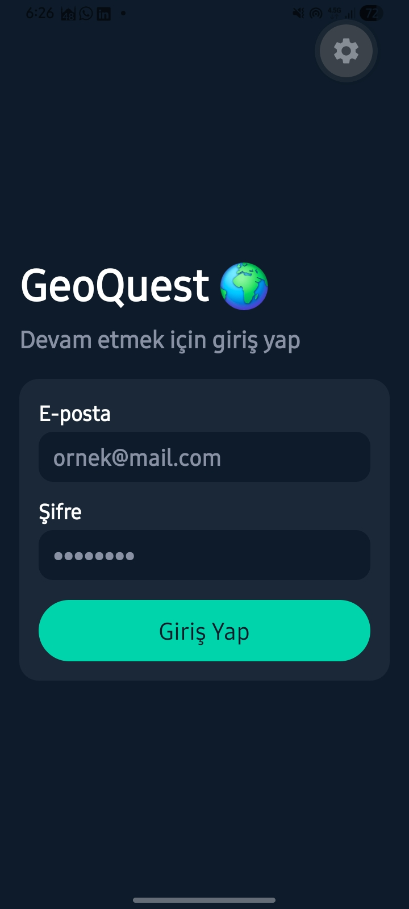
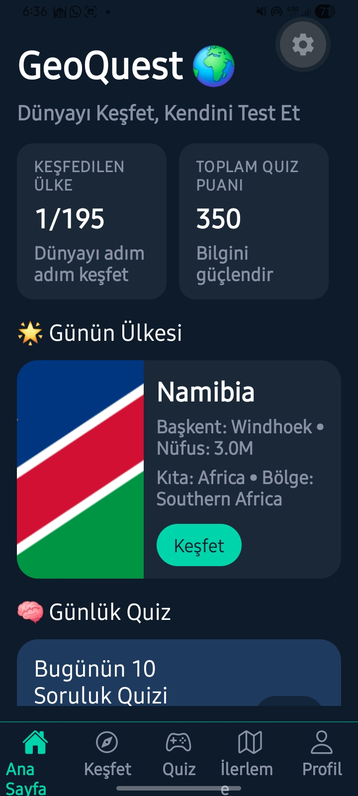
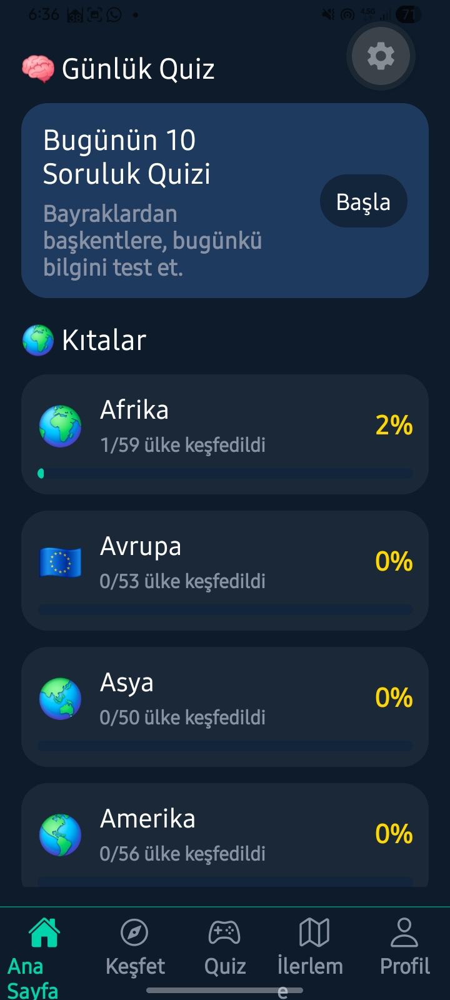
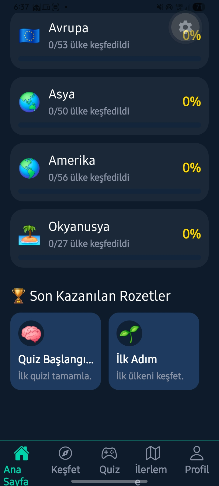
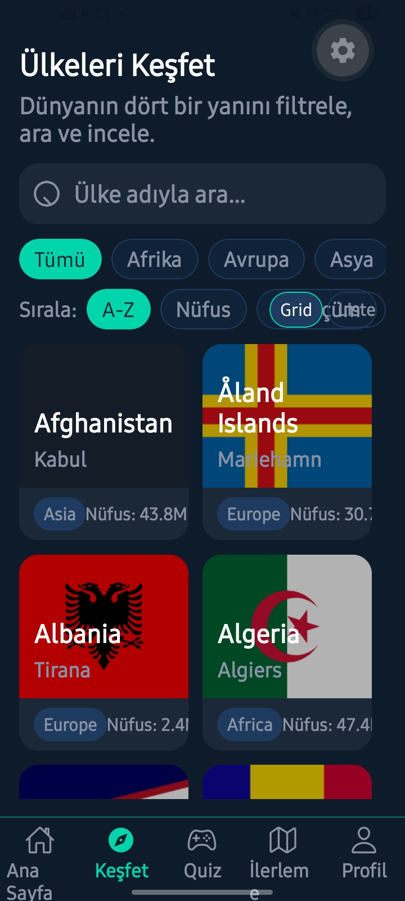
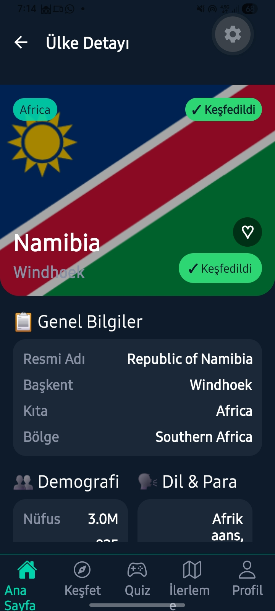
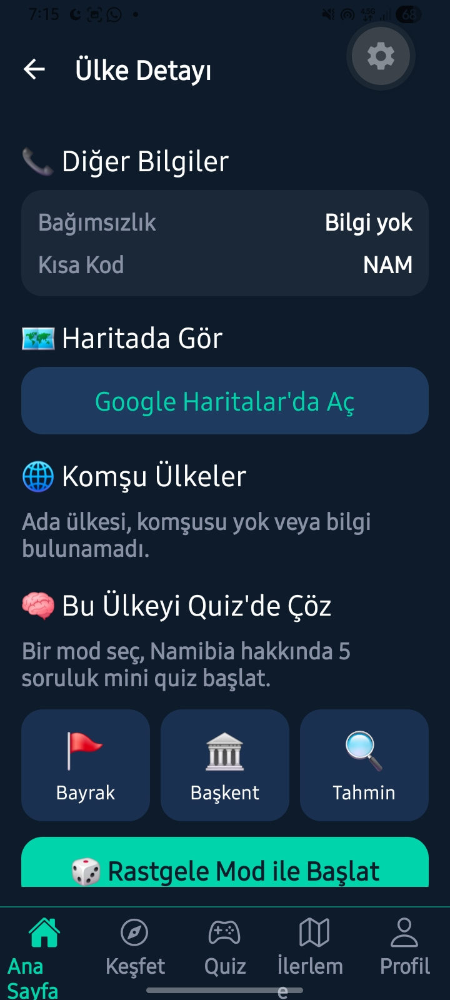
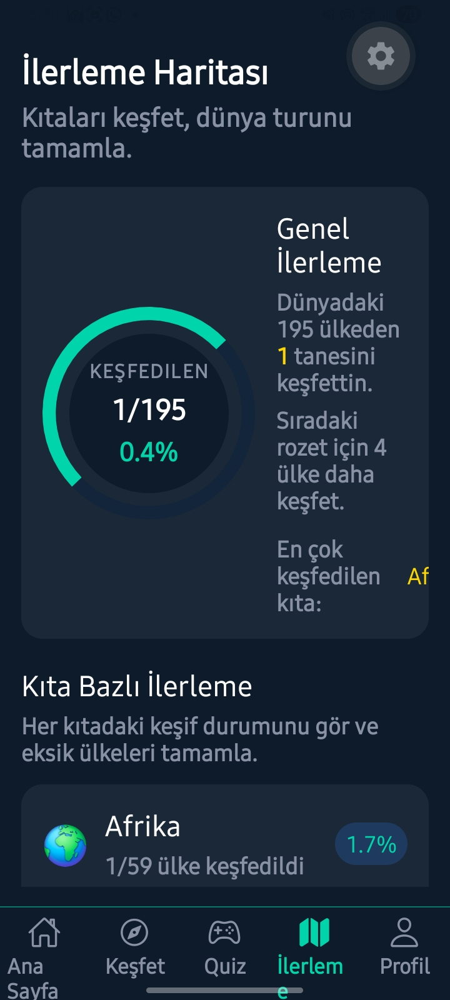
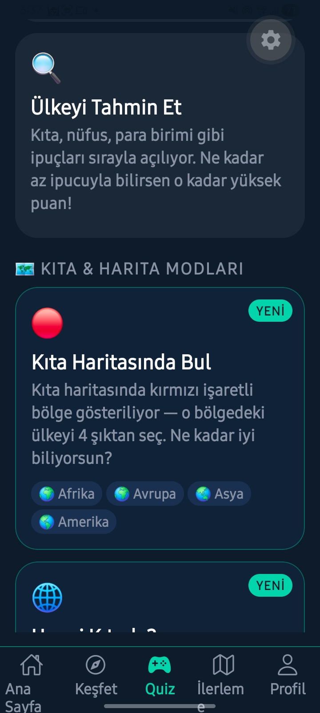
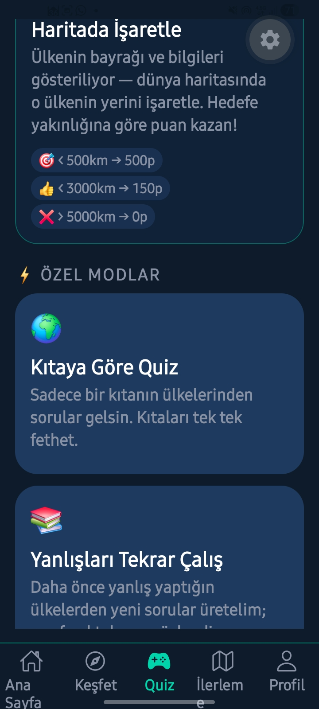

# GeoQuest 🌍

> **Explore the World, Test Yourself.**
> A React Native mobile application that lets you explore world countries using the REST Countries API, learn geographic information, and test your knowledge with interactive quizzes.

---

## 📸 Screenshots


<div align="center">
  
  &nbsp;&nbsp;
  
  &nbsp;&nbsp;
  
  &nbsp;&nbsp;
  
  &nbsp;&nbsp;
  
  &nbsp;&nbsp;
  
  &nbsp;&nbsp;
  
  &nbsp;&nbsp;
  
  &nbsp;&nbsp;
  
  &nbsp;&nbsp;
  
</div>

---

## ✨ Features

### 🏠 Home Screen
- **Country of the Day:** A featured country card that rotates daily with quick facts.
- **Daily Quiz:** 10-question daily challenge to keep your streak alive.
- **Continent Summary:** Quick progress tracking of explored countries by continent.
- **Latest Badges:** Your most recently earned achievements.

### 🔍 Explore & Search
- **Smart Search:** Real-time filtering with 300ms debounce.
- **Filter & Sort:** Filter by continent, sort by A-Z / Population / Area.
- **Grid / List View:** Toggle between compact grid or detailed list view.
- **Exploration Tracking:** Green checkmark indicator on explored countries.

### 🗺️ Country Details
- General Info, Demographics, Languages & Currencies, Timezone details.
- **Neighboring Countries:** Horizontal scrolling list of border neighbors.
- **Mini Quiz:** 5-question quiz specific to the selected country.
- **Google Maps:** Open country directly on the map.

### 🧠 Quizzes
- **3 Different Modes:**
  1. **Find the Flag** — Guess the country from its flag (15s/question).
  2. **Find the Capital** — Find the capital from the country name (20s/question).
  3. **Guess the Country** — Clues unlock in order: Continent → Population → Neighbors → Currency → Flag. Score higher with fewer clues!
- **Streak System:** Bonus points and animations for consecutive correct answers.
- **Practice Mistakes:** Generate questions from countries you previously got wrong.
- **Continent Quiz:** Questions from only the selected continent.

### 📊 Progress & Badges
- Continent-based animated progress bars.
- 12 collectable badges.
- Profile screen with quiz history and accuracy statistics.

---

## 🛠️ Technologies

| | |
|---|---|
| Framework | React Native (Expo) |
| Language | TypeScript |
| Navigation | React Navigation (Bottom Tabs + Stack) |
| HTTP | Axios |
| State | Custom Hooks + AsyncStorage |
| UI | StyleSheet · expo-linear-gradient · react-native-safe-area-context |
| Images | expo-image |
| API | REST Countries API v3.1 |

---

## 📂 Project Structure

```
src/
├── api/          # Axios instance and API services
├── components/   # Reusable UI components
├── config/       # Configuration files
├── hooks/        # Custom hooks (useCountries, useQuiz)
├── navigation/   # Tab and stack navigators
├── screens/      # Application screens
├── store/        # AsyncStorage data management
├── theme/        # Colors, spacing, typography
└── types/        # TypeScript interfaces
```

---

## ⚙️ Installation

```bash
# Clone the repository
git clone https://github.com/afakruha2003/GeoQuest.git
cd GeoQuest

# Install dependencies
npx create-expo-app GeoQuest --template expo-template-blank-typescript
cd GeoQuest

npx expo install @react-navigation/native @react-navigation/bottom-tabs @react-navigation/stack
npx expo install axios @react-native-async-storage/async-storage
npx expo install expo-linear-gradient expo-image
npx expo install react-native-safe-area-context react-native-screens react-native-gesture-handler

# Start the development server
npx expo start
```

After starting:
- `a` → Run on Android emulator
- `i` → Run on iOS simulator
- Scan QR code → Open in Expo Go on physical device

---

## 🌐 API

Uses REST Countries API v3.1 — free, no key required.

For performance, only necessary fields are fetched:
```
/all?fields=name,flags,capital,population,area,region,subregion,languages,currencies,borders,cca3,maps
```

Data is fetched once on app launch and cached in memory.

---

## 💾 Local Storage (AsyncStorage)

All user data is stored locally on the device:

| Key | Description |
|---|---|
| `explored_countries` | Country cca3 codes of explored countries |
| `favorite_countries` | Favorited countries |
| `quiz_scores` | Detailed history of quiz attempts |
| `wrong_countries` | Countries you got wrong (for practice) |
| `badges` | Badge earning status |
| `streak_data` | Daily streak tracking |
| `daily_quiz` | Daily quiz status |

---

## 🏅 Badge System

| Badge | Condition |
|---|---|
| 🌱 First Steps | Explore first country |
| 🌍 Traveler | Explore 10 countries |
| 🗺️ Explorer | Explore 50 countries |
| 🌐 World Citizen | Explore 100 countries |
| 🧠 Quiz Beginner | Complete first quiz |
| 🏆 Quiz Master | Earn 500 points |
| 🔥 On Fire | 5 correct answers in a row |
| ⚡ Unstoppable | 10 correct answers in a row |
| 🌍 Africa Explorer | Explore all countries in Africa |
| 🇪🇺 Europe Explorer | Explore all countries in Europe |
| 💯 Perfect | 100% accuracy in a quiz |
| 📅 Dedicated | Solve quizzes 7 days in a row |

---

## 🎨 Design System

Modern dark theme optimized for readability and flag colors:

| Token | Value |
|---|---|
| Background | `#0D1B2A` |
| Surface / Card | `#1B2838` / `#1E3A5F` |
| Primary | `#00D4AA` |
| Accent | `#FFD700` |
| Danger / Success | `#FF4757` / `#2ED573` |

---

## 📄 License

MIT License.
